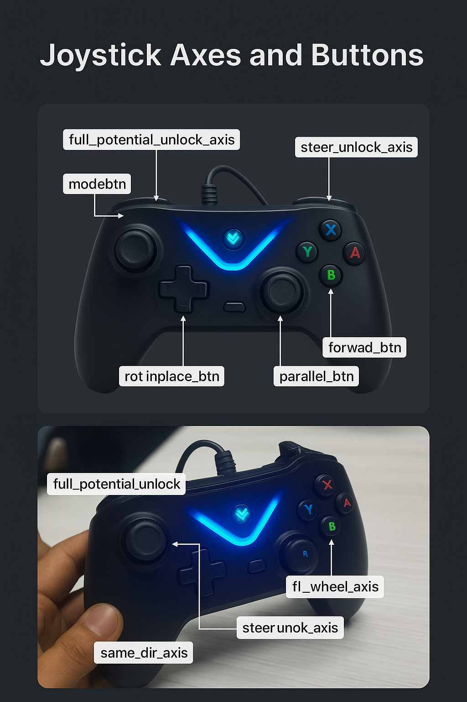

# Controlling the Rover in different modes using a Joystick/Controller

# Table of Contents

# Table of Contents

* [Overview](##overview)  
* [The Controller](#detailed-description)  
  * [Joystick](#joystick)  
  * [Steering and Full Potential](#steering-and-full-potential)  
  * [Drive](#drive)  
  * [Manual and Autonomous Mode](#manual-and-autonomous-mode)  
  * [PWM message](#pwm-message)  
* [REQUIREMENTS](#requirements)  
* [USAGE](#usage)

## Overview

This code basically tells the rover how to understand the commands given via the controller. Ensure this code runs in python3 and on ros1.

## The Controller 

### Joystick: 

This code has been made keeping in mind the following joystick/controller for controlling the rover:   
  
We get the inputs from the joystick from the “/joy” topic, which is established by the joy.launch file.   
In the code, the various buttons and axes are referenced by the following constants:

| Variable Name | Value | Significance |
| :---- | :---- | :---- |
| self.modeupbtn | 7 | Cycles up the modes (0 \- 4\) |
| self.modednbtn | 6 | Cycles down the modes (4 \- 0\) |
| self.fb\_axis | 1 | Forward-backward motion while driving |
| self.lr\_axis | 2 | Left-Right motion while driving  |
| self.forward\_btn | 4 | Aligns all the wheels parallel to chassis |
| self.parallel\_btn | 1 | Aligns all the wheels perpendicular to chassis |
| self.rotinplace\_btn | 3 | Aligns all the wheels to rotate in place |
| self.autonomous\_btn | 0 | Button to toggle between autonomous mode and manual control mode |
| self.steer\_unlock\_axis | 4 | Holding this axis at maximum unlocks steering |
| self.steer\_samedir\_axis | 2 | Holding this axis at maximum unlocks full potential steering |
| self.steer\_oppdir\_axis | 3 | This rotates the wheels in opposite directions |
| self.full\_potential\_unlock\_axis | 5 | This rotates all the wheels in the same direction |
| self.fl\_wheel\_axis | 1 | Controls front left wheel during full potential |
| self.fr\_wheel\_axis | 3 | Controls front right wheel during full potential |
| self.bl\_wheel\_axis | 0 | Controls back left wheel during full potential |
| self.br\_wheel\_axis | 2 | Controls back right wheel during full potential |
| self.curve\_opp\_str | 0 | Fourth axis that allows for curved motion of the rover |

## Steering and Full Potential: 

This is the main foundation of the code. It subdivides the rover controlling problem into three different conditions: 

- Steering and Full Potential are both locked (Locked Steering) 
- Steering is unlocked  
- Full Potential is unlocked

( Both cannot be unlocked at the same time by design)

In each of these cases, the buttons and axes perform slightly different functions. Each mode allows a certain form of control of the rover.

- When both are locked, the wheels can be aligned for one of three different alignments:  
  - Forward alignment  
  - Parallel alignment  
  - Rotate-In-Place alignment  
- When steering is unlocked, the wheels start rotating for movement, for four different motions:  
  - Turn all the wheels by 45 degrees from their current position,  
    - Clockwise  
    - Anticlockwise  
  - Rotate all the wheels in the same direction  
  - Rotate wheels in opposite directions  
- When full potential control is unlocked, all the wheels of the rover can be controlled independently.

All of this is done within the steering() function, which also has the helper function steer(), which deals with the PWM data that has to be sent to achieve the final angle from the initial angle, along with the “mode”, which differentiates relative and absolute encoders.

## Drive:

Once the steering of the rover is complete and both steering and full potential control are locked, the rover can be driven with velocity (which depends on whether the rover is in manual or autonomous mode), again in two different ways:

- If the rover is aligned for rotating in-place, give velocity.  
- Otherwise, give velocity and omega.

The velocities are calculated with smoothing, by taking the average of the previous three velocities so as to avoid sudden jerks. This is achieved with maintaining a queue, and adding the newest calculated velocity.

## Manual and Autonomous Mode: 

The rover can run in either manual and autonomous mode, based on what state the rover is currently in (self.state):

- If it is True, the rover is in autonomous mode.  
- If it is False, the rover is in manual mode.

## PWM message

The PWM message is initialised as an Int32MultiArray() with detailed layout. The data stores eight values, 

- The first four values are the velocities along the wheel.  
- The last four values are the rotational velocities of the wheel.

The variable self.init\_dir is just a placeholder of sorts.

# REQUIREMENTS 

* Dependency on traversal/msg/WheelRpm, time, copy.

* Subscriptions to the topics /joy, /enc\_auto, /motion and /rot.

* Publishers to the topics /motor\_pwm and /state (optional).

# USAGE 

This script forms the foundation of controlling the rover with the controller, so connect a controller and using joy.launch we can begin the control of the rover. 

# LICENSE

Take lite bro.
