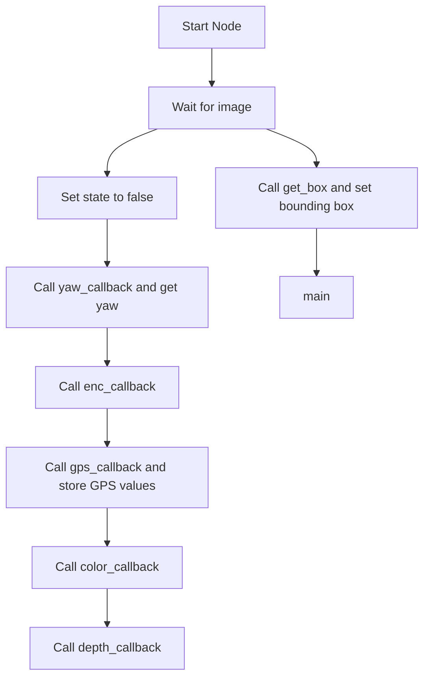

# ZedDepth ROS Node

This ROS node processes RGB and depth images from a ZED camera to detect cones and arrows, and navigate based on visual and GPS cues. It uses YOLO models for object detection and publishes motion commands accordingly.

---

## 🚀 Code Flow Overview

The main components of this system are:
- **Image Subscribers**: For color and depth images from ZED.
- **YOLO Detection**: For detecting cones and arrows in the color image.
- **Depth Extraction**: Uses bounding boxes to get the Z-distance to the detected object.
- **GPS Feedback**: To aid navigation decisions.
- **Motion Control**: Sends velocity commands to the robot using geometry_msgs.

### ✅ Execution Pipeline



---

## 📦 Class and Method Reference

### `__init__()`
- Initializes:
  - ROS node and subscribers (color, depth, GPS, IMU)
  - YOLO models for arrow and cone detection
  - CvBridge for image conversion
  - Publishers for velocity commands
  - Variables to store image, GPS, yaw, detection flags

---

## Methods:
1. `state_callback()`: Makes the state `self.state` `False`.
2. `color_callback()`: Converts the input image into an OpenCV compatible form (`BGR` Image), crops it to the specified size (`30:330, 170:490`) and makes the flag `self.image_avbl` `True`.
3. `depth_callback()`: Same as `color_callback` but deals with the depth and keeps it in its original format using `passthrough`.
4. `get_box()`: Loads and runs the YOLO model (loaded from `best_cube.pt`) and sets a bounding box with the boundary conditions as `self.latest_xmin`, `self.latest_ymin`, `self.latest_xmax`, `self.latest_ymax`.
5. `cone_model()`:
- Same as `get_box` but uses a different YOLO model loaded from `Cone.pt`.
- It also calculates the depth of the centre of the cone detected (`self.depth`).
- It then returns `self.ret`, x-coordinate for the arrow centre `arrow_centre` and `self.depth`.
7. `arrowdetectmorethan3()`: Works similar to `cone_model`'s latter part as an extension of `get_box`. It works on the bounding box generated and returns its centre `arrow_centre`, as well as its depth `self.depth` if applicable.
8. `arrowdetectlessthan3()`:
- Takes the gaussian blur of the input image, resizes it and then analyzes the left and right templates (`self.templatel, self.templater`), after which the template scores are matched and the one with the higher score (by value of `max_loc_l, max_loc_r`) decides the direction.
- It then calculates the depth of the centre of the arrow, and stores as `z` or Soham Distance.
- Finally, it stores the confidence `conf` and finalises the direction in case `conf` is greater than `69`.
- It then returns the depth and direction.
9. `cone()`:
- Applies HSV mask, morphological filtering, blur and then does contour detection using `convexHull` and `approxPolyDP`.
- It then draws rectangular bounding boxes around shapes that look like cones using `self.convex_hull_pointing_up` function and then returns the list of bounding boxes `bounding_rect`.
10. `convex_hull_pointing_up()`: Analyses the aspect ratio `aspect_ratio=w/h` to values less than `0.7`, area `w*h>1000` and then checks the values of `point` in contour `ch` to check if the contour shape matches an upward facing cone and returns `True` if that is the case.
11. `move_straight()`:
- It controls the robot to move forward toward the arrow and controls the motion when it nears the arrow, using Proportion control. Once it reaches the arrow, a flag is published `wheelrpm_pub.publish(msg)`. and `self.gpscalled` is made `1`.
- If the direction is known, the gps coordinates of `100` samples are stored and averaged in `lat_sum, lat_av, lon_sum, lon_avg` and then writted onto `sparsh2.csv`.
- The bot is then turned by `90` degrees to face in the direction of the arrow, which is activated by `self.pls_call_rot_once`.
- If nothing is encountered, it keeps going straight.
12. `v1_competition()`: It first stops the rover and publishes the corresponding message and if `self.state` is `True`, prints the message to press `A` to go to autonomous mode or remain in joystick mode if `False`.
13. `process_dict()`:
- Prints `self.searchcalled` as well as an `if` statement (that is not needed), if `self.searchcalled` is `True`, it reads a dictionary `self.angles_dict`, stores the key for the minimum distance as `self.min_dist` and then finds the average of the angles where the arrow was found at `self.min_dist` as `self.which_enc_angle_to_turn`.
- Based on the sign of `self.which_enc_angle_to_turn`, it decideds whether the rover should turn `left` or `right`.
14. `rotate()`:
- Performs directional rotation until the angle difference between `self.rotate_angle` and `diff (self.z_angle - self.initial_yaw)` is less than `0.5 * self.angle_thresh`.
- It also checks if `diff` is less than or greater than `120` and then accordingly increments or decrements by `360`.
15. `rot_in_place()`: Does rotation-in-place maneuvre once and similarly computes how much more to rotate like `self.rotate`.
16. `search()`:
- This function tracks the time `time.time()` and stops the rover by making `msg1.omega` and `msg1.vel` equal to `0`.
- It also initialises the `msg.data` list PWM values to `0`.
- In a `while` loop, `abs(self.enc_data) < abs(self.start_angle) - 2 * self.angle_thresh` is kept so that the angle does not cross `60`, and if this condition is satisfied, then the PWM values mapped to 8 bit (standard PWM format) (multiplied by `255`) from `self.base_rot_dir` are published. Then, `self.init` is made `True`.
- Now, if arrow has not been detected 9`self.ret` is `False`) and the angle rotated by the camera (realsense `self.enc_data`) is less than/equal to the start angle `self.start_angle` (has not gone beyond `60` degrees), the camera keeps roating till the arrow is found.
- Once arrow is found, the detected arrow angle (`self.enc_data`) is appended to ` self.angles_dict[self.distance]`.
- In both cases (whether arrow is found or not), the same `msg` is published.
- Once the realsense crosses `60` degrees, it is further rotated until the the realsense becomes less than `self.angle_thresh`, and keeps publishing th PWM values till then.
- Once the above condition is satisfied, all PWM values are publishes as `0`.
17. `quaternion_to_euler()`: Computes the `pitch, roll` and `yaw` and returns those values using quaternions.
18. `yaw_callback()`: Generates the yaw in degrees, first stores the initial yaw as `self.initial_yaw` and then computes the yaw as `self.z_angle = self.z_angle_in_rad*180/math.pi - self.initial_yaw` or `self.z_angle = self.z_angle_in_rad*180/math.pi` if `self.yaw_initialization_done` is `True`. Then it normalises the yaw to range `-180` to `180`.
19. `enc_callback()`: updates `self.enc_data` with `msg.data[1]`, which contains the encoder angles.
20. `gps_callback()`: Stores the latitude and longitude values (if they are non Null) in `self.current_latitude` and `self.current_longitude`.
21. `main()`: It is the master function which decides what to do, and accordingly calls `self.process_dict`, `self.search` (if `self.turn` and `self.ret` are `False`), `self.move_straight` (if `self.turn` is `False` and `self.ret` is `True`) `self.rot_in_place` (if `self.distance`<`1.5`) or `self.rotate` (if `self.distance`>`1.5`) to perform straight motion, rotation to a particular angle, rotation in place or to process dictionary. 
22. `run()`: If image is available and exists, it calls the `self.get_box` and `self.main` functions and also maintains to `rospy` rate as `10`.
#


### 🔧 Other Helpers

#### `quaternion_to_euler(x, y, z, w)`
- Converts quaternion orientation from IMU into Euler yaw angle.

#### `shutdown()`
- Stops robot motion on shutdown.

---

### 🔁 Main Execution

```python
if __name__ == '__main__':
    obj = ZedDepth()
    obj.run()
```

- Initializes the class and continuously checks detection flags.
- Decides between:
  - `move_straight()` (for cone)
  - `arrowdetectlessthan3()` or `arrowdetectmorethan3()` (for arrows)
  - `search()` if nothing is detected.

---

## 📎 Dependencies

- ROS 2 (tested on Humble)
- OpenCV
- CvBridge
- YOLOv5/8 models
- geometry_msgs, sensor_msgs, nav_msgs

---

## 📝 Notes

- Ensure ZED camera drivers are installed and topics are published correctly.
- Tune YOLO thresholds and depth ranges as per your environment.
- Tested on Jetson Orin with onboard ZED 2i and USB RPi Camera.

---
```
